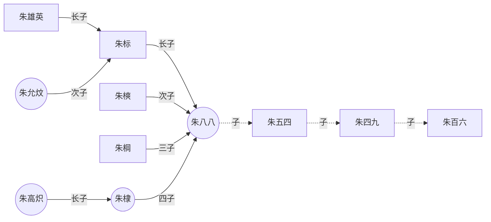

---
# the default layout is 'page'
icon: fas fa-link
order: 4
mermaid: true
---

***
# blogs
---
[酷 壳 – CoolShell](https://coolshell.cn)  
[阮一峰的网络日志](https://www.ruanyifeng.com/blog/)  
[Deepin 王勇](https://manateelazycat.github.io/)  
[ldsink](https://ldsink.com/)  

# cheatSheets
---
[Markdown](https://commonmark.org/help/)  
[vim](https://vim.rtorr.com/)  
[nginx](https://github.com/SimulatedGREG/nginx-cheatsheet)  

# Front End tools
---
## mock 数据 
### [json-server](https://github.com/typicode/json-server)    
- 特点：支持 restful 风格接口的增删改查
- 支持静态资源图片等存储 
- 基于 nodejs 环境
- [怎么使用](https://juejin.cn/post/7043424909472563208)，[restful](http://ruanyifeng.com/blog/2014/05/restful_api.html)

